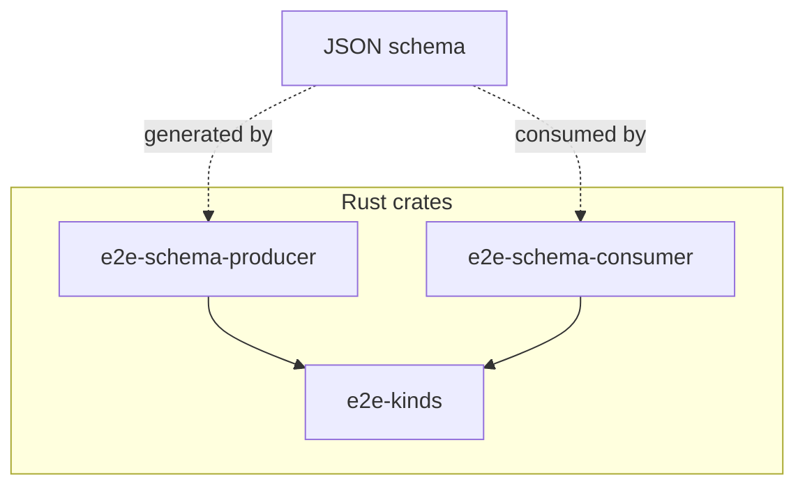

# End-to-end schema example

This directory contains an end-to-end example of automatic schema generation and replacement across a JSON Schema boundary.

This example consists of three crates:

1. [**`e2e-kinds`**](e2e-kinds): The base crate that defines the kinds. Both the producer and the consumer depend on this crate.
2. [**`e2e-schema-producer`**](e2e-schema-producer): This crate generates the schema. In a client-server context this is typically the server.
3. [**`e2e-schema-consumer`**](e2e-schema-consumer): This crate converts the schema into Rust types. In a client-server context this is typically the client.

Here's the dependency graph between the nodes

